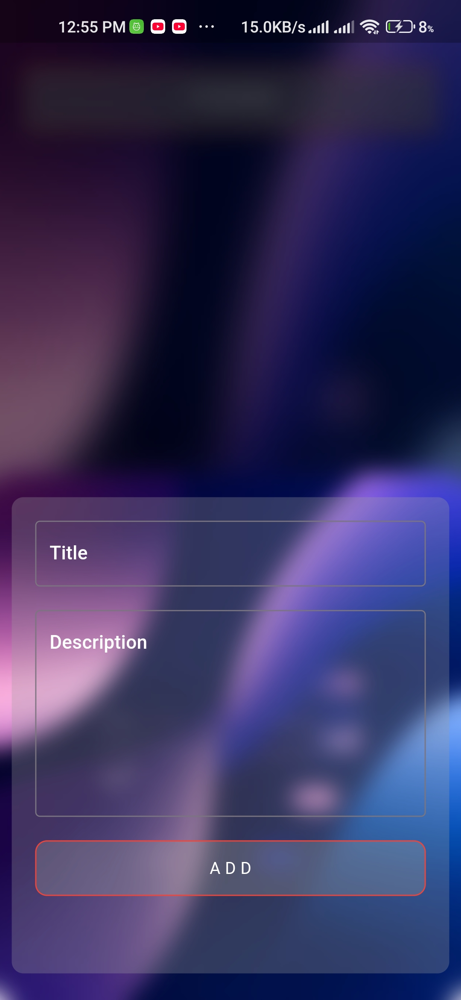
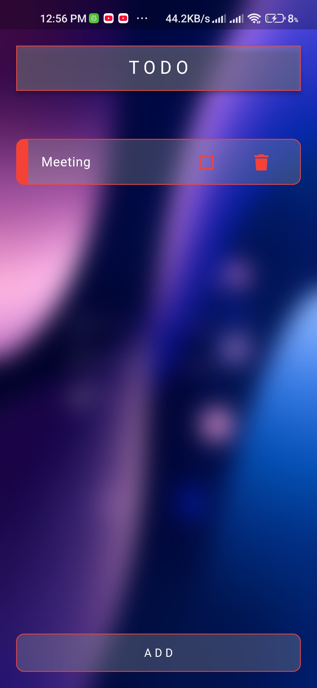

# 📝 Todo

To-Do is a simple and elegant task management app built with Flutter. This app allows you to create, manage, and organize tasks, helping you stay productive and on top of your daily responsibilities. With an easy-to-use interface and seamless functionality, To-Do makes task management fun and efficient.

---

## 🌟 Features

- **Task Creation**: Easily create tasks with title and description.
- **Task Completion**: Mark tasks as completed with a simple toggle.
- **Task Deletion**: Remove tasks when they're no longer needed.
- **Dynamic UI**: Real-time updates of tasks list.
- **Persistent Storage**: Tasks are saved locally even after closing the app.

---

## 📱 Screenshots

### Preview

<center>
<div style="display:flex;gap:20px;">



</div>
</center>

---

## 🚀 Installation

1. Clone the repository:

   ```bash
   git clone https://github.com/0sureshyadav0/todo.git
   ```
2. Navigate to the project directory:
  ```bash
  cd todo
  ```
3. Install dependencies:

   ```bash
   flutter pub get
   ```
4. Run the app:
   ```bash
   flutter run
   ```
---

##🛠️ Technologies Used
- **Flutter**: The app framework.
- **Dart**: Programming language.
- **Provider Package**: For state management.
- **Hive Package**: For local storage.
  
---

## 📂 Project Structure
```bash
todo/
├── lib/
│   ├── screens/
│   │   ├── task_list_screen.dart
│   │   ├── task_detail_screen.dart
│   ├── providers/
│   │   └── task_provider.dart
│   └── main.dart
├── assets/
│   ├── images/
│   │   └── logo.png
└── pubspec.yaml
```
---

## 📄 License
This project is licensed under the MIT License. See the LICENSE file for details.

---

## 🧑‍💻 Developer
Suresh Yadav
🌐 [sureshyadav.info.np](https://www.sureshyadav.info.np)

---

## 🙌 Contribution
Contributions are welcome! Feel free to open an issue or submit a pull request.

---

## 📞 Support
For any issues or feedback, contact Suresh Yadav.

---

Stay organized with To-Do! 📋
